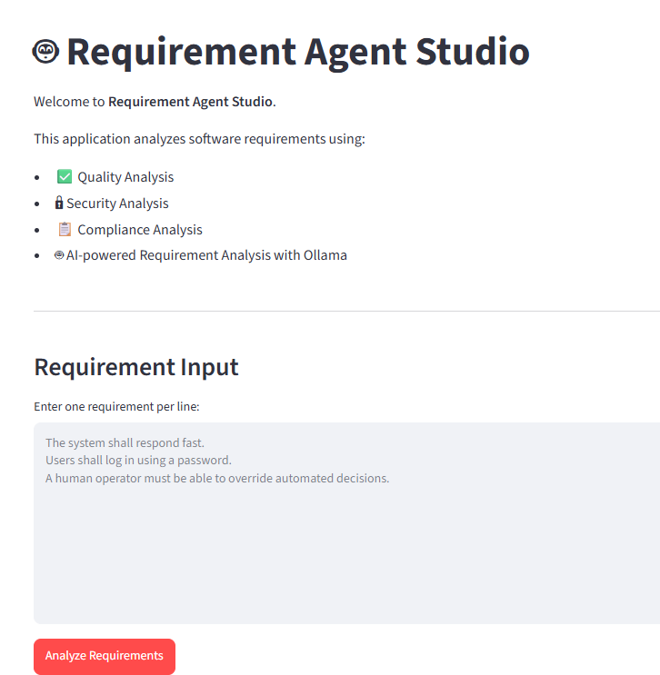
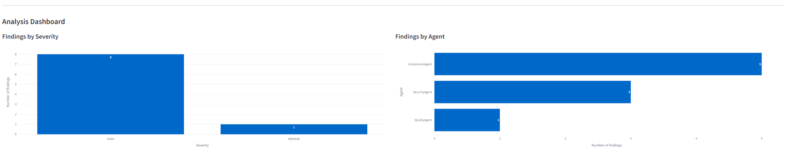
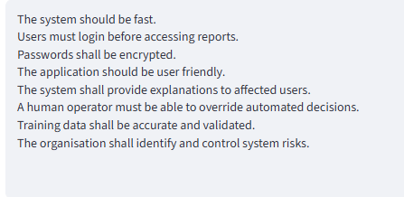
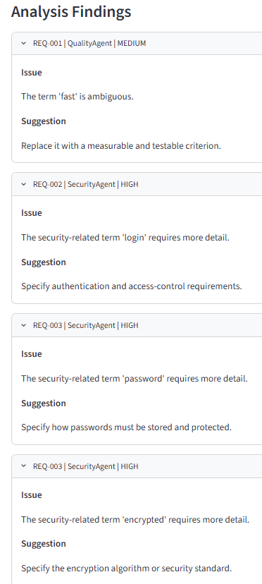
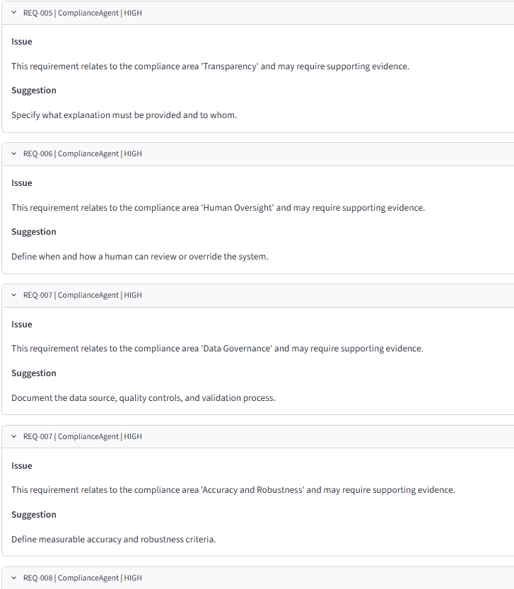

# 🤖 Requirement Agent Studio

An AI-powered Software Requirements Analysis platform built with **Python**, **Streamlit**, and **Ollama**. The application automatically extracts software requirements, analyzes their quality, detects security and compliance issues, and generates a professional analysis report.

---

## 📖 Overview

Requirement Agent Studio helps software engineers and business analysts improve software requirements before development begins.

The system uses multiple AI-powered analysis agents to detect:

- Ambiguous requirements
- Missing security considerations
- Compliance issues
- Requirement quality problems

The application provides an interactive web interface built with Streamlit and generates downloadable Markdown reports.

---

## ✨ Features

- Extract requirements from input text
- AI-powered ambiguity detection using Ollama
- Requirement quality analysis
- Security analysis
- Compliance analysis
- Interactive Streamlit dashboard
- Plotly visualizations
- Downloadable Markdown report
- Modular multi-agent architecture
- Unit testing with pytest
- GitHub Actions CI workflow

---

## 🏗️ System Architecture

```
                  Requirement Document
                           │
                           ▼
           Requirement Extraction Agent
                           │
                           ▼
                  Requirement Objects
                           │
                           ▼
                  Analysis Pipeline
        ┌─────────────┬─────────────┬─────────────┐
        ▼             ▼             ▼
 Quality Agent   Security Agent  Compliance Agent
        │             │             │
        └─────────────┴─────────────┘
                      │
                      ▼
                 Analysis Findings
                      │
                      ▼
            Markdown Report Generator
                      │
                      ▼
               Streamlit Dashboard
```

---

## 🧠 AI Model

This project uses **Ollama** for local Large Language Model inference.

Default model:

```
llama3.2:3b
```

Advantages:

- Runs locally
- No cloud API required
- Privacy friendly
- Fast inference

---

## 🛠️ Technology Stack

| Technology | Purpose |
|------------|---------|
| Python | Backend |
| Streamlit | Web Application |
| Ollama | Local LLM |
| Plotly | Dashboard Charts |
| Markdown | Report Generation |
| Pytest | Unit Testing |
| GitHub Actions | Continuous Integration |

---

## 📂 Project Structure

```
requirement-agent-studio/
│
├── .github/
│   └── workflows/
├── config/
├── data/
├── output/
├── src/
│   └── requirement_agent_studio/
├── tests/
├── streamlit_app.py
├── main.py
├── requirements.txt
├── pyproject.toml
├── README.md
└── .gitignore
```

---

## 🚀 Installation

Clone the repository

```bash
git clone https://github.com/saima-imran/requirement-agent-studio.git
```

Move into the project directory

```bash
cd requirement-agent-studio
```

Create a virtual environment

```bash
python -m venv venv
```

Activate the environment

Windows

```bash
powershell
.\venv\Scripts\Activate.ps1
```

Install dependencies

```bash
pip install -r requirements.txt
```

---

## 🤖 Install Ollama

Download Ollama from

https://ollama.com

Pull the required model

```bash
ollama pull llama3.2:3b
```

Start Ollama

```bash
ollama serve
```

---

## ▶️ Run the Application

Activate the virtual environment

```bash
powershell
.\venv\Scripts\Activate.ps1
```

Run Streamlit

```bash
python -m streamlit run streamlit_app.py
```

---

## 📊 Dashboard

The Streamlit dashboard provides:

- Requirement statistics
- Severity distribution
- Findings by analysis agent
- Interactive Plotly charts
- Downloadable Markdown report

---

## 📄 Generated Report

The application generates a Markdown report containing:

- Requirement summary
- Quality findings
- Security findings
- Compliance findings
- AI recommendations

---

## 🧪 Testing

Run all tests

```bash
pytest
```

---


## Screenshots

### Application Home Page



### Analysis Dashboard



### Analysis Findings



### Report Download



### Generated Markdown Report



## 🔮 Future Improvements

- PDF report generation
- DOCX requirement import
- Requirement traceability matrix
- Risk assessment agent
- REST API
- Docker deployment
- Multi-language support
- Authentication
- Cloud deployment

---

## 👨‍💻 Author

**Saima Imran**

AI-powered Software Requirements Analysis Platform

Built using Python, Streamlit, Plotly, and Ollama.

---

## 📜 License

This project is licensed under the MIT License.

---

## ⭐ Acknowledgements

- Python
- Streamlit
- Ollama
- Plotly
- GitHub


